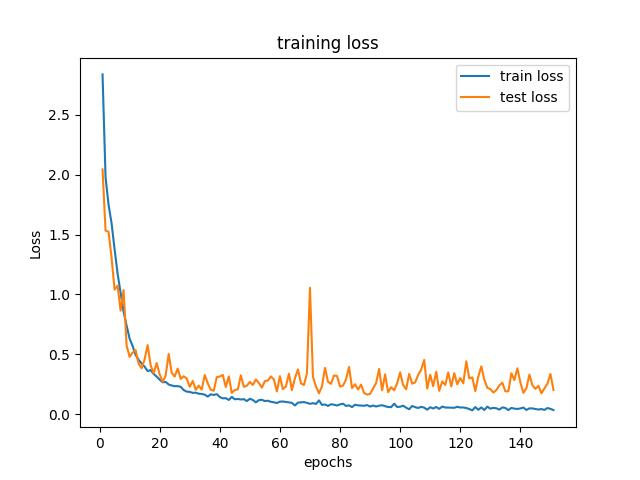
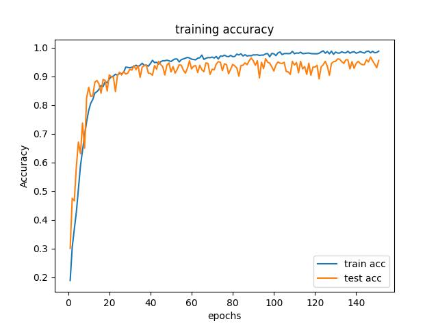

# Plant-Seedlings-Classification

PyTorch implementation Plant-Seedlings-Classification[^1] task. 
Highest score on Kaggle is `0.95843` using ResNeXt-101 (64x4d)[^2] 
To see the detail about model and training, check **Training** 

## SetUp
To see environment setup, see `requirements.txt`. 
Training on GTX 1080Ti with CUDA version 11.4

## Training
You can run following commend to start training: 
`python main.py --device=<your_GPU_number> --epoch=<default_111> --lr=<default_1e-4> --batch_size=<default_2>` 
The best result of validation and testing are shown belowe, you can get the model weight by click here
Training set and validation (testing) set were splited by ratio 0.85, have 4027 images of the training set and 711 images of the validation set.
Here's the model_36242 training loss and accuracy history:

Final Training Loss is `0.0351`, validation(testing) Loss is `0.2027`, and Training accuracy is `0.9881`, validation(testing) accuracy is `0.9557`. 
You can see the all training history and model detail in `./figure/log_<id>.txt`.

## Demonstrate
use following commend to demo the test dataset: 
`python demo.py --id<model_id> --epoch<default_110> --img_resize<make_sure_same_with_training> --device<your_GPU_number>` 
`output_<id>.csv` will be create after commend running sussesful.

[^1]: Giselsson, T.M., Jørgensen, R.N., Jensen, P.K., Dyrmann, M., & Midtiby, H.S. (2017). "A Public Image Database for Benchmark of Plant Seedling Classification Algorithms," ArXiv, abs/1711.05458.
[^2]: S. Xie, R. Girshick, P. Dollár, Z. Tu and K. He, "Aggregated Residual Transformations for Deep Neural Networks," 2017 IEEE Conference on Computer Vision and Pattern Recognition (CVPR), 2017, pp. 5987-5995
